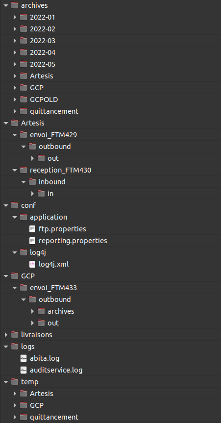

== Présentation du projet

ABITA est une application permettant la gestion d'un parc immobilier.
L’application comprend les fonctionnalités suivantes :

- création et recherche de Tiers, Logements, Contrat tiers, Occupants et Contrat Occupant
- calcul et transmission des loyers mensuels et des charges,
- calcul et transmission des avantages en natures associés aux conditions de logement,
- transmission des éléments permettant la comptabilisation des éléments relatifs aux loyers des agents et au règlement des bailleurs tiers.

L’outil entretient des interactions avec d'autres composants :

- une première application (Artesis), pour l’échange des données RH et la transmission des données prises en compte en paie,
- une seconde application (GCP), pour la transmission des éléments nécessaires à la constitution des pièces comptables.

Il existe 3 profils d’utilisateurs sur ABITA :

- Consultation : Ce profil n’a accès qu’en consultation aux données présentes dans ABITA

- Utilisateur : Ce profil a la possibilité de créer de nouveaux éléments dans ABITA (Tiers, Logements, Contrat tiers, Occupants, Contrat occupant)

- Administrateur : Ce profil a accès aux fonctions administratives (modification du référentiel, insertion des fichiers de la première application, téléchargement des pièces comptables et fichiers des deux applications tierces, administration des utilisateurs, administration technique)

== ENVIRONNEMENTS

:application-name: ABITA
:application-name-min: abita

==== Applications déployées
[options="header"]
|===
|Binaire |Version|Commentaires
|TOMCAT|9.0.34|Pour gérer tomcat, commande(s) : systemctl [status;start;stop]
|JAVA|11.0.1|
|OJDBC|19.3.0.0|
|===

==== Logs
[options="header"]
|===
|Application|PATH
|{application-name}|/applis/{application-name-min}/logs
|TOMCAT|/applis/tomcat9/instance_abita_tomcat9/logs
|===

== Installation Environnement
=== Arborescence du répertoire de configuration

- Dans le répertoire `/applis/` doit se trouver un répertoire Abita. Ce répertoire doit avoir l'arborescence suivante.

=== Configuration de tomcat
- Déplacer le serveur Tomcat dans le répertoire `/applis/`.
- Editer le fichier `catalina.properties` dans le dossier `/conf` du tomcat.
A la suite de la ligne `common.loader=`, ajouter:

[source]
----
,"/applis/conf_externe/abita/application","/applis/conf_externe/abita/log4j"
----
- Editer le fichier server.xml dans le dossier /conf du tomcat.
Entre les balises <GlobalNamingResources>, ajouter (pour la base de donnée d'intégration) :

[source]
----

  <Resource name="UserDatabase" auth="Container"
              type="org.apache.catalina.UserDatabase"
              description="User database that can be updated and saved"
              factory="org.apache.catalina.users.MemoryUserDatabaseFactory"
              pathname="conf/tomcat-users.xml" />

    <Resource name="jdbc/jndi/abita"
      auth="Container"
      type="javax.sql.DataSource"
      factory="org.apache.tomcat.jdbc.pool.DataSourceFactory"
      driverClassName="oracle.jdbc.OracleDriver"
      maxActive="10"
      maxIdle="3"
      maxWait="10000"
      url="jdbc:oracle:thin:@ADRESSE_IP:PORT/SERVICE_NAME"
      username="ABITA"
      password="ABITA"
      removeAbandoned="true"
      removeAbandonedTimeout="300"
      logAbandoned="true"
      validationQuery="SELECT 1 FROM DUAL"
      testWhileIdle="true"
      timeBetweenEvictionRunsMillis="30000"
      numTestsPerEvictionRun="3"
      minEvictableIdleTimeMillis="60000"/>

----

- Ajouter un fichier `setenv.sh` dans le repertoire `bin` du tomcat.
Insérer les lignes suivantes:
----
#!/bin/sh

export UMASK=0022

export JAVA_OPTS="$JAVA_OPTS -Djava.security.egd=file:/dev/urandom"
----

- Ajouter le fichier `ojdbc10.jar` dans le repertoire `lib` du tomcat.

Pour le projet Abita, il faut copier le dossier "conf_externe" là où l'on souhaite sur son environnement et ajouter les chemins nécessaires dans le fichier "catalina.properties" du Tomcat.

La ligne en question :

[source]
----
common.loader="${catalina.base}/lib","${catalina.base}/lib/*.jar","${catalina.home}/lib","${catalina.home}/lib/*.jar","/home/USER/projets/conf_externe_java/abita/application","/home/USER/projets/conf_externe_java/abita/log4j"
----

=== Création de la base de données

Exécuter le script `create_db.sql` dans le répertoire `database`, afin de créer la BDD d'ABITA.

=== Utilisateurs

Les utilisateurs sont à insérer dans la table FWK_USER en base de données.